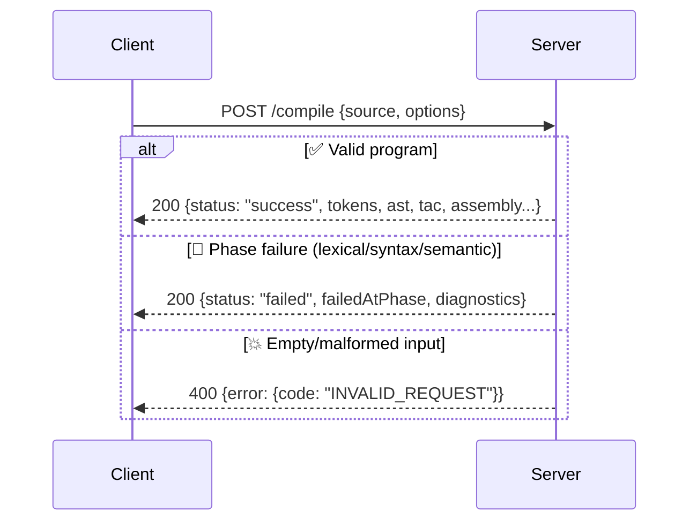
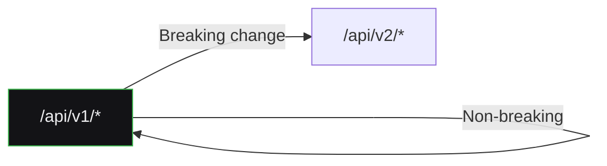

<div align="center">

# 🔌 API Contract Specification
## SmartCC — Backend REST API


</div>

> ✅ **Status: fully implemented** in `backend/app/routers/`. Originally written as a forward-looking blueprint (v1) so the mock adapter's shape would be contractually identical to the real backend — that promise held: `httpAdapter.ts` needed **zero shape changes** when connected in Sprint 15.

---

## ⚙️ 1. Purpose

This document defines the exact REST contract the backend implements. Written *before* the backend existed, it ensured the frontend's `CompilerService` interface never had to change shape — only the adapter swapped.

---

## 🌐 2. Base Conventions

| Setting | Value |
|---|---|
| 🔗 Base URL (dev) | `http://localhost:8000/api/v1` |
| 📦 Format | JSON only |
| 🔐 Auth | None required (v1-v2); Bearer token planned v3+ |
| 🚨 Errors | Consistent envelope (§7) |

---

## 🧩 3. Endpoint: Compile Source Code

### `POST /compile`



> 💡 **Key design decision:** even on compilation *failure*, HTTP status is `200` — a phase failure is a valid, expected product outcome, not a server error. Only genuine server faults return `5xx`.

**Request**
```json
{
  "source": "int main() {\n  int x = 5;\n  return x + 2;\n}",
  "options": { "targetOptimizations": ["constant-folding"] }
}
```

**Response — 200 ✅ (success)**
```json
{
  "status": "success",
  "tokens": [{ "id": "t1", "type": "KEYWORD", "value": "int", "line": 1, "column": 1 }],
  "ast": { "id": "n1", "kind": "FunctionDecl", "children": [], "line": 1 },
  "symbolTable": [{ "name": "x", "type": "int", "scope": "main", "declaredAt": 2 }],
  "diagnostics": [],
  "tac": [{ "id": "i1", "op": "=", "arg1": "5", "result": "x" }],
  "optimization": { "before": [...], "after": [...], "passesApplied": ["Constant Folding"] },
  "assembly": [{ "instruction": "MOV", "operands": ["EAX", "5"] }]
}
```

**Response — 200 🚨 (phase failure)**
```json
{
  "status": "failed",
  "failedAtPhase": "semantic",
  "diagnostics": [{
    "severity": "error",
    "message": "Undeclared variable 'y' used in expression",
    "line": 3,
    "phase": "semantic"
  }],
  "tac": [], "optimization": null, "assembly": []
}
```

---

## 📖 4. Endpoint: Get Grammar Definition

### `GET /grammar/{grammarId}`

```json
{
  "id": "c-like-v1",
  "name": "C-Like Subset Grammar",
  "productions": [
    { "lhs": "func_decl", "rhs": ["type_spec", "IDENTIFIER", "(", ")", "{", "stmt_list", "}"] }
  ],
  "sampleProgram": "int main() { return 0; }"
}
```

---

## 🕒 5. Endpoint: Compilation History

### `GET /history/{projectId}?limit=20&offset=0`

```json
{
  "total": 47,
  "items": [
    { "id": "comp_9182", "projectId": "proj_42", "timestamp": "2026-07-20T10:15:00Z", "status": "success", "failedAtPhase": null },
    { "id": "comp_9181", "projectId": "proj_42", "timestamp": "2026-07-20T09:58:00Z", "status": "failed", "failedAtPhase": "syntax" }
  ]
}
```

---

## 📁 6. Endpoint: Project CRUD (v3 — not yet built)

| Method | Path | Purpose |
|:---:|---|---|
| 🟢 `GET` | `/projects` | List all projects |
| 🔵 `POST` | `/projects` | Create a project |
| 🟢 `GET` | `/projects/{id}` | Get project detail |
| 🟡 `PATCH` | `/projects/{id}` | Rename/update |
| 🔴 `DELETE` | `/projects/{id}` | Delete project |

> Detailed bodies finalized when v3 kicks off — not speculated in full now (per `Phases.md` §6.4).

---

## 🚨 7. Error Envelope (All Endpoints)

```json
{ "error": { "code": "COMPILATION_TIMEOUT", "message": "...", "statusCode": 504 } }
```

| Code | Status | Meaning |
|---|:---:|---|
| `INVALID_REQUEST` | `400` | Malformed request body |
| `UNAUTHORIZED` | `401` | Missing/invalid token (v3+) |
| `NOT_FOUND` | `404` | Resource not found |
| `COMPILATION_TIMEOUT` | `504` | Exceeded execution budget |
| `INTERNAL_ERROR` | `500` | Unhandled server fault |

---

## 🔢 8. Versioning Policy



Product version (`Phases.md` v1-v4) and API version (`/api/v1`) are **intentionally decoupled**. Breaking changes get a new prefix — never in-place breaking changes.
