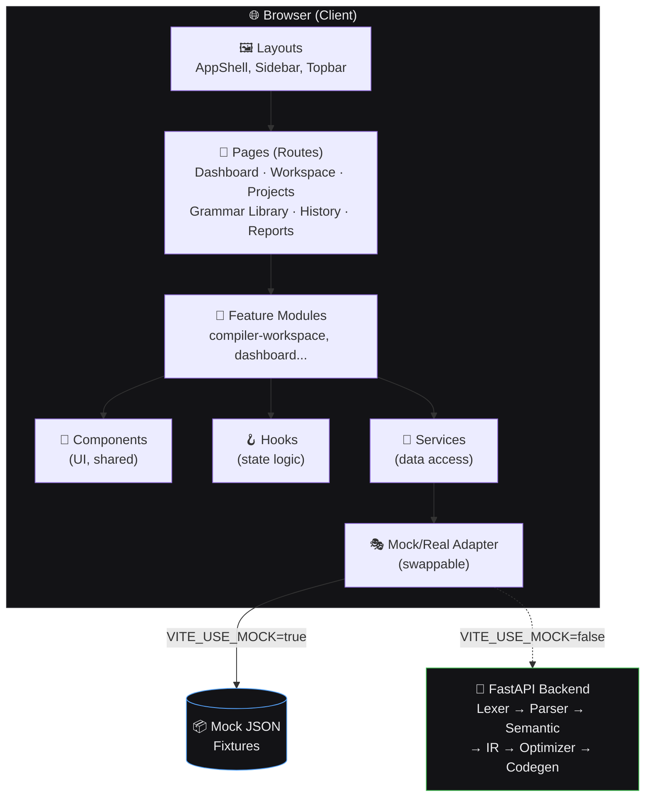
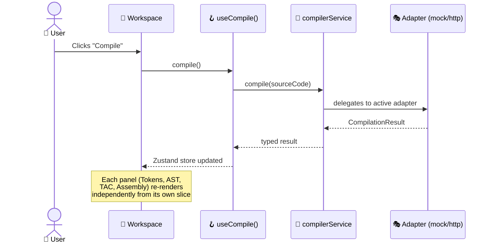
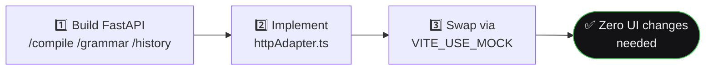

<div align="center">

# 🏗️ Architecture Document
## SmartCC — Frontend Architecture


</div>

| Field | Value |
|---|---|
| Scope | Frontend architecture — see [`SystemDesign.md`](./SystemDesign.md) for the compiler modules |
| Related Docs | [`PRD.md`](./PRD.md), [`SystemDesign.md`](./SystemDesign.md) |

---

## 🧭 1. Architectural Principles

| # | Principle | Why it matters |
|---|---|---|
| 1 | 🧩 **Feature-based, not type-based** | Code organized by product feature (`compiler-workspace`, `dashboard`) not technical layer |
| 2 | 🔌 **Mock-first, backend-ready** | Data access goes through a stable service layer — swapping mock for real API needs zero UI changes |
| 3 | 🧱 **Composable UI, not monolithic pages** | Every visualization is standalone, reusable, embeddable anywhere |
| 4 | 📐 **Strict typing everywhere** | Compiler outputs (tokens, AST, TAC) are shared TypeScript types — single source of truth |
| 5 | 👁️ **Progressive disclosure** | Dashboard shows summaries; Workspace shows depth |

---

## 🗺️ 2. High-Level System Diagram



> ✅ **Both paths shown above are real as of v2** — `VITE_USE_MOCK` genuinely toggles between them ([`httpAdapter.ts`](../frontend/src/services/httpAdapter.ts), Sprint 15).

---

## 📁 3. Folder Structure (Authoritative)

```
frontend/
├── src/
│   ├── 🚪 app/                     App bootstrap, providers, router config
│   │   ├── App.tsx
│   │   ├── router.tsx
│   │   └── lazyRoutes.tsx          Code-split page imports
│   │
│   ├── 🖼️ layouts/                 Shell layouts
│   │   ├── AppShell.tsx
│   │   ├── Sidebar.tsx
│   │   └── Topbar.tsx
│   │
│   ├── 📄 pages/                   Route-level containers (thin, compose features)
│   │   ├── DashboardPage.tsx  ProjectsPage.tsx  WorkspacePage.tsx
│   │   ├── GrammarLibraryPage.tsx  HistoryPage.tsx  ReportsPage.tsx
│   │   └── SettingsPage.tsx  HelpPage.tsx
│   │
│   ├── 🧩 features/                Feature-based modules (core business logic)
│   │   ├── compiler-workspace/
│   │   │   ├── components/         Editor, PipelineStepper, TokenViewer...
│   │   │   ├── hooks/               useCompile
│   │   │   ├── store/                Zustand workspace state
│   │   │   └── mocks/                Sample compilation fixtures
│   │   ├── dashboard/  grammar-library/  history/  reports/  settings/  projects/
│   │
│   ├── 🧱 components/              Global, cross-feature reusable UI
│   │   ├── ui/          Card, Badge, DataTable, Accordion...
│   │   ├── data-table/  Shared TanStack Table wrapper
│   │   └── feedback/    Loading/error states
│   │
│   ├── 🪝 hooks/                   App-wide generic hooks
│   ├── 🔌 services/                Data access layer
│   │   ├── compilerService.ts      Interface + env-based adapter switch
│   │   ├── mockAdapter.ts          Simulated backend
│   │   └── httpAdapter.ts          Real FastAPI backend (Sprint 15)
│   │
│   ├── 📐 types/                   Shared/global TypeScript types
│   ├── 🎨 styles/                  Tailwind design tokens
│   └── 🛠️ lib/                     Pure utility functions
│
├── public/
├── index.html
├── tailwind.config.ts
└── vite.config.ts
```

---

## 🔄 4. Data Flow Architecture

### 4.1 Compile Request Flow



### 4.2 Service Layer Contract (Backend-Ready)

The `compilerService` exposes the **same interface** regardless of data source:

```typescript
interface CompilerService {
  compile(source: string, options?: CompileOptions): Promise<CompilationResult>;
  getGrammar(id: string): Promise<GrammarDefinition>;
  getHistory(projectId: string): Promise<CompilationRecord[]>;
}
```

> 💡 This is why the Sprint 15 swap needed **zero component changes** — `httpAdapter.ts` implements the exact same contract as `mockAdapter.ts`.

---

## 🧠 5. State Management Strategy

| State Type | Tool | Reasoning |
|---|---|---|
| 🌍 Global UI state (theme, sidebar) | React state | Lightweight, infrequent updates |
| 🧪 Pipeline/workspace state | **Zustand** | Cross-component, frequent updates, no prop drilling |
| 📁 Projects, Settings | **Zustand** | Local-only, in-memory (v1) |
| 🎛️ Local component state | `useState`/`useReducer` | Isolated concerns (editor cursor, panel resize) |

---

## 🧱 6. Component Design Standards

- ✅ Every visualization component (`TokenViewer`, `ParseTreeView`, `SymbolTableView`, `TACViewer`, `AssemblyViewer`) accepts **typed props only** — never reaches into global state directly
- ✅ Shared primitives (`Card`, `Badge`, `DataTable`, `Accordion`) live in `components/ui`, built once
- ✅ Loading and error states handled by shared `<AsyncState>` components, not duplicated per feature

---

## 📏 7. Non-Functional Requirements

| Category | Requirement | Status |
|---|---|---|
| ⚡ Performance | Route-level code splitting; Monaco lazy-loaded | ✅ |
| ♿ Accessibility | Keyboard navigable, ARIA labels | ✅ |
| 📱 Responsiveness | Usable at ≥360px width | ✅ |
| 🌑 Theming | Dark theme, centralized tokens | ✅ |
| 📐 Type Safety | `strict: true`, no implicit `any` | ✅ |
| 🛡️ Error Handling | Phase-tagged error panel + friendly network errors | ✅ |

---

## 🔀 8. Migration Path to Real Backend



> ✅ **Completed in Sprint 15** — see [`CHANGELOG.md`](./CHANGELOG.md) for the full verification story (including CORS testing and two real bugs caught along the way).

---

## 🗓️ 9. Delivery Model

Built **sprint by sprint**, with explicit approval gates after each one (per [`PRD.md`](./PRD.md) §12).

| Sprint | Delivered | Status |
|---|---|---|
| 1 | App shell, routing, layout, design system | ✅ |
| 2 | Dashboard (stats + charts) | ✅ |
| 3 | Compiler Workspace: Editor + Pipeline Stepper | ✅ |
| 4 | Token Viewer + Symbol Table | ✅ |
| 5 | Parse Tree visualization | ✅ |
| 6 | Semantic Report + TAC + Optimization Comparison | ✅ |
| 7 | Assembly Viewer + Console/Error Panel | ✅ |
| 8 | Grammar Library, History, Reports, Settings, Help | ✅ |

<div align="center">

**All 8 sprints complete.** See [`Phases.md`](./Phases.md) for what came after (v2 backend).

</div>
