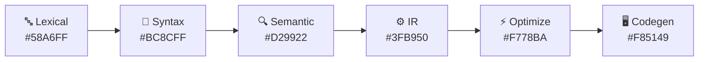

# 🎨 Design System Specification
## SmartCC — Colors, Type, Spacing & Motion

| Field | Value |
|---|---|
| Applies To | All frontend components |

---

## 🧭 1. Design Philosophy

SmartCC should feel like a **professional developer tool**, not an academic project.

<table>
<tr><th>Reference</th><th>What we borrow</th></tr>
<tr><td>🆚 <b>VS Code</b></td><td>Editor chrome, panel resizing, monospace precision, dark-first palette</td></tr>
<tr><td>🐙 <b>GitHub</b></td><td>Card layouts, status badges, diff/comparison views</td></tr>
<tr><td>📐 <b>Linear</b></td><td>Motion restraint, spacing discipline, typography hierarchy</td></tr>
</table>

> 🚫 **Rule of thumb:** if a UI decision feels "collegiate" (bright gradients, cartoonish icons, default Bootstrap look) — reject it.

---

## 🎨 2. Color System

### 2.1 Base Palette (Dark Theme — Default)

 `#0A0A0B` — App background

 `#131316` — Cards, panels

 `#1C1C1F` — Elevated panels (modals, dropdowns)

 `#2A2A2E` — Default borders/dividers

 `#3A3A3F` — Focus/hover borders

 `#EDEDEF` — Primary text

 `#A1A1A6` — Secondary/muted text

 `#5C5C61` — Disabled state

### 2.2 Accent Colors

 `#5E6AD2` — Primary actions (Compile button, active nav)

 `#3FB950` — Successful compilation, passed checks

 `#D29922` — Warnings (non-fatal)

 `#F85149` — Errors

 `#58A6FF` — Informational badges, active pipeline stage

### 2.3 Phase-Specific Accent Mapping 🔑

Each compiler phase gets a consistent identity color used across the Pipeline Stepper, badges, and diagnostic tags:

> ⚠️ These map directly to `CompilerPhase` values in [`SystemDesign.md`](./SystemDesign.md) — every diagnostic, badge, and pipeline node uses this exact mapping. **Never introduce a one-off color for a phase.**

---

## ✍️ 3. Typography

| Role | Font | Weight | Size |
|---|---|---|---|
| 🔤 UI Text | Inter | 400 / 500 / 600 | 14px base |
| 📰 Headings | Inter | 600 / 700 | 20–32px scale |
| 💻 Code / Tokens / TAC / Assembly | **JetBrains Mono** | 400 / 500 | 13px |

### Type Scale

| Token | Size | Usage |
|---|---|---|
| `text-xs` | 12px | Badges, captions |
| `text-sm` | 13px | Table cells, secondary labels |
| `text-base` | 14px | Body text |
| `text-lg` | 16px | Section labels |
| `text-xl` | 20px | Card titles |
| `text-2xl` | 24px | Page titles |
| `text-3xl` | 32px | Dashboard hero stats |

> 📏 **Rule:** code/data output (tokens, TAC, assembly, parse tree labels) is **always** monospace — never Inter — so it visually reads as "machine output" vs. "UI chrome."

---

## 📐 4. Spacing System

Base unit: **4px**. All spacing must be a multiple of 4.

`space-1` `4px` ▪️ `space-2` `8px` ▪️▪️ `space-3` `12px` ▪️▪️▪️ `space-4` `16px` ▪️▪️▪️▪️ `space-6` `24px` `space-8` `32px` `space-12` `48px`

| Token | Value | Usage |
|---|---|---|
| `space-1` | 4px | Icon-to-text gaps |
| `space-2` | 8px | Compact padding |
| `space-3` | 12px | Card internal padding (tight) |
| `space-4` | 16px | Standard card padding |
| `space-6` | 24px | Section spacing |
| `space-8` | 32px | Page-level margins |
| `space-12` | 48px | Major section breaks |

---

## 🧱 5. Radius & Elevation

| Token | Value | Usage |
|---|---|---|
| `radius-sm` | 6px ⌐ | Badges, inputs |
| `radius-md` | 10px ⌐ | Buttons, small cards |
| `radius-lg` | 14px ⌐ | Panels, main cards |
| `shadow-panel` | soft | Resting card elevation |
| `shadow-modal` | strong | Overlays, dropdowns |

> No hard drop-shadows or skeuomorphic effects — elevation is subtle; borders do most of the visual separation work.

---

## 🎬 6. Motion (Framer Motion)

| Interaction | Duration | Relative Speed |
|---|---|---|
| Hover states | 100ms | `██` |
| Tab/route change | 150ms | `███` |
| Modal/dropdown open | 180ms | `████` |
| Panel expand/collapse | 200ms | `████` |
| Pipeline stage transition | 300ms | `██████` |

| Interaction | Duration | Easing |
|---|---|---|
| Panel expand/collapse | 200ms | `easeOut` |
| Pipeline stage transition | 300ms | `easeInOut` |
| Tab/route change | 150ms | `easeOut` |
| Hover states | 100ms | `linear` |
| Modal/dropdown open | 180ms | `easeOut` |

> 🎯 **Rule:** motion communicates state change, never decorates for its own sake. If an animation doesn't help track cause → effect, cut it.

---

## 🧩 7. Component Visual Standards

| Component | Standard |
|---|---|
| 🔘 Buttons | Solid accent for primary; ghost/outline for secondary; never 2 solid-primary buttons per view |
| 🏷️ Badges | Pill-shaped, phase-colored, always paired with text (never color-only) |
| 📊 Tables | Monospace cells, sticky header, border-based row dividers |
| 🗂️ Cards | Rounded, soft shadow, subtle border — never floats without one |
| 💻 Code Editor | Custom Monaco theme, synced to phase-colors for diagnostics |

---

## ♿ 8. Accessibility Notes

- ✅ Minimum contrast ratio **4.5:1** for all text on backgrounds
- ✅ Phase colors are never the *only* differentiator — always paired with text/icon
- ✅ All interactive elements reachable via keyboard (Tab order = visual layout)
- ✅ Focus states always visible — never `outline: none` without a replacement
