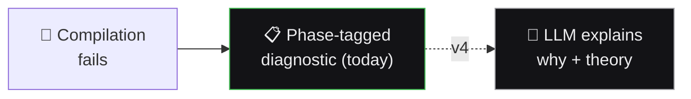
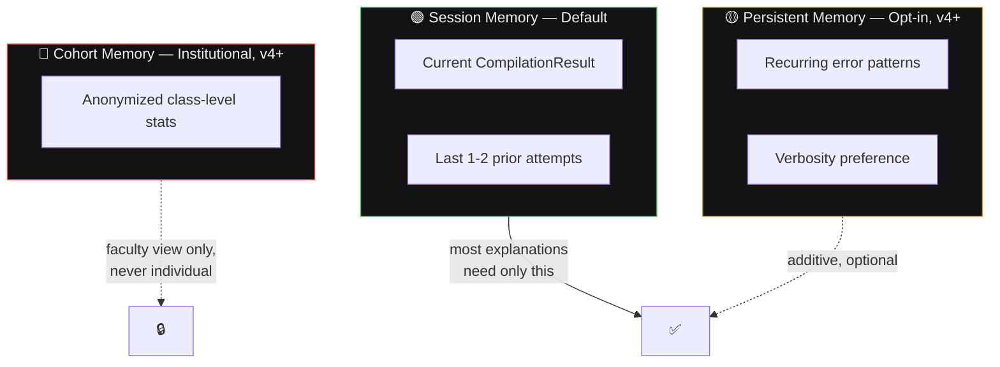

<div align="center">

# 🧠 AI Engine Context & Memory Architecture
## SmartCC — Forward-Looking Blueprint (v4)


</div>

> 🔮 **Nothing in this document is implemented before v4.** SmartCC's core product (v1-v2, both complete) has no AI engine. This specifies the memory architecture for **"AI Error Explanation"** ([`PRD.md`](./PRD.md) §14).

---

## 🎯 1. Purpose & Scope

When a program fails to compile, SmartCC already shows a phase-tagged diagnostic. The v4 feature adds an **LLM layer** on top that explains *why* — in plain language, tied to compiler theory.



This document ensures explanations feel relevant, the system doesn't silently accumulate data, and future cohort features have a clean foundation — **without over-building for a use case that may never materialize.**

---

## 🗂️ 2. Three Memory Scopes



### 🟢 2.1 Session Memory (Ephemeral — Default)

| | |
|---|---|
| **Scope** | A single compile-and-explain interaction |
| **Contains** | Current result + last 1-2 prior attempts in the same session |
| **Lifetime** | Cleared on tab close — never persisted |

> 💡 Most "why did this fail" questions only need current + immediately-prior state.

### 🟡 2.2 Persistent Memory (Per-User, Opt-In, v4+)

| ✅ Contains | ❌ Does NOT contain |
|---|---|
| Recurring error patterns (tailors tone only) | Full transcripts of every compilation |
| Explicit verbosity preference | Any "skill level" label shown to the student |

> 🗑️ Retention is user-controlled — a "clear my learning history" action must exist.

### 🔴 2.3 Cohort Memory (Aggregate, Institutional-Only, v4+)

- Anonymized patterns across a class ("42% hit a scope error on Assignment 3")
- 🔒 **Never** used to generate individual explanations — faculty-facing only

---

## 📦 3. What Feeds the AI Engine (v4 Illustrative Shape)

```json
{
  "sessionContext": {
    "currentResult": "CompilationResult",
    "priorAttempts": ["CompilationResult", "CompilationResult"]
  },
  "persistentContext": {
    "verbosityPreference": "detailed",
    "recentRecurringPhaseErrors": ["semantic"]
  },
  "cohortContext": null
}
```

`cohortContext` is `null` in the student flow **by design** — it only populates the separate faculty reporting view.

---

## 📏 4. Design Principles (Binding When v4 Is Built)

| # | Principle |
|---|---|
| 1️⃣ | 🟢 Session memory does most of the work — others are additive, optional |
| 2️⃣ | 🚫 No silent data accumulation — persistent memory is opt-in and clearable |
| 3️⃣ | 🤝 Explanations never punish or label — depth adapts, verdicts don't |
| 4️⃣ | 🔒 Cohort data never leaks into individual explanations |
| 5️⃣ | ⏸️ **This entire document is inert until v4** — no code written early |

<div align="center">

🔮 *This blueprint waits for* [`Phases.md`](./Phases.md) *Sprint 21 — building it now would mean designing against a product that doesn't exist yet.*

</div>
