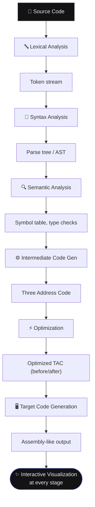
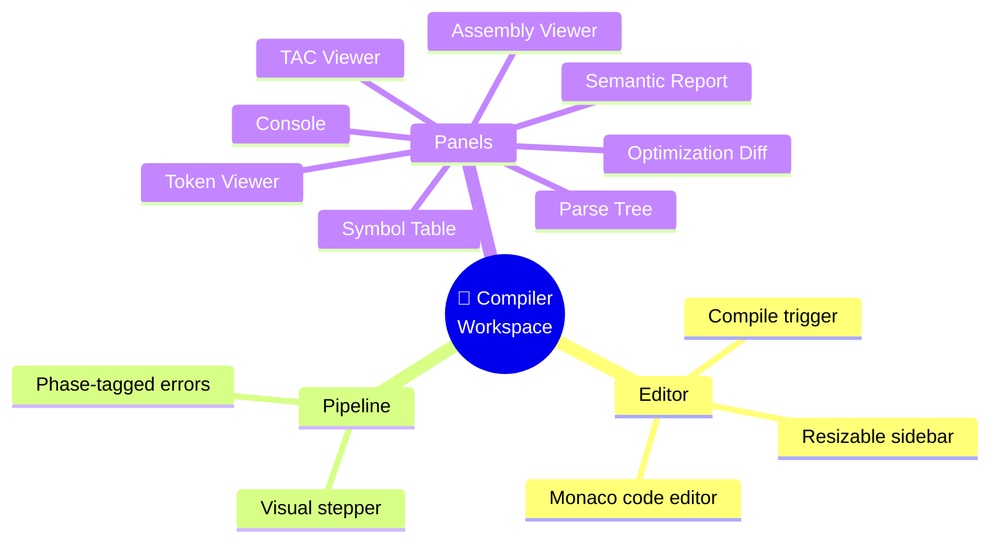
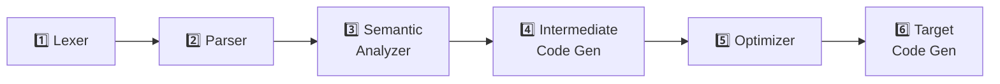

# 📋 Product Requirements Document
## SmartCC — Intelligent Mini Compiler & Interactive Compiler Visualizer

---

## 🎯 1. Executive Summary

SmartCC is a modern, web-based educational compiler platform that helps students understand every phase of compiler design through interactive, real-time visualization.

Traditional compiler-design lab work treats each phase (lexer, parser, semantic analysis, code generation) as an isolated experiment. SmartCC unifies all of these into a single continuous pipeline, so a student can submit one source program and watch it move — stage by stage — from raw text to optimized assembly.

> 🧭 **Design north star:** the product should feel like **VS Code + GitHub + Linear**, not like a college lab assignment.

---

## 😖 2. Problem Statement

Compiler Design courses are typically taught through disconnected experiments:

<table>
<tr><td>🔤 Lexical Analyzer</td><td>🎯 FIRST / FOLLOW set computation</td></tr>
<tr><td>🌳 Recursive Descent Parser</td><td>🔀 Shift-Reduce Parser</td></tr>
<tr><td>⚙️ Three Address Code (TAC) generation</td><td>⚡ Code Optimization</td></tr>
</table>

**Resulting gaps:**

| Problem | Impact |
|---|---|
| 🚫 No visualization | Students memorize algorithms without seeing them work |
| 🔗 No end-to-end pipeline | No understanding of how phases connect |
| 🐛 Poor debuggability | Errors are cryptic, hard to trace to a phase |
| 🖥️ Outdated tooling | CLI-only tools feel disconnected from real engineering |
| 🧩 No unified UI | Every experiment is a separate, throwaway script |

---

## 💡 3. Proposed Solution

SmartCC accepts C-like source code and runs it through a complete compiler pipeline, rendering every intermediate stage visually and interactively.

Each stage is independently viewable, inspectable, and explains itself (what happened, why, and what the output means).

---

## 🎯 4. Product Goals

| # | Goal |
|---|---|
| 1️⃣ | Build a complete, working educational compiler experience |
| 2️⃣ | Cover the full academic Compiler Design syllabus |
| 3️⃣ | Provide interactive, stage-by-stage visualization |
| 4️⃣ | Deliver a professional SaaS-grade UI (not a lab-report UI) |
| 5️⃣ | Maintain a modular, extensible architecture |
| 6️⃣ | Produce portfolio-quality software suitable for recruiter/company review |

---

## 👥 5. Target Users

<table>
<tr>
<td width="50%" valign="top">

### 🎓 Primary
- B.Tech students (Compiler Design / TOC)
- M.Tech students
- Faculty demonstrating compiler concepts

</td>
<td width="50%" valign="top">

### 🌐 Secondary
- Universities (as a teaching tool)
- Self-learners studying compilers
- Researchers prototyping small language features

</td>
</tr>
</table>

---

## 🛠 6. Tech Stack

<table>
<tr>
<td valign="top" width="50%">

**Frontend**

- Tailwind CSS, Framer Motion, React Router
- Monaco Editor (code editing)
- React Flow (parse tree / pipeline visualization)
- TanStack Table (symbol tables, token tables)
- shadcn/ui (component primitives)

</td>
<td valign="top" width="50%">

**Backend** *(originally deferred — see box below)*

- PLY (Python Lex-Yacc) for lexer/parser core
- SQLAlchemy + PostgreSQL *(v3, not yet built)*

</td>
</tr>
</table>

> 📌 **Historical note:** at the time this PRD was written, the build phase used mock JSON data only, with backend explicitly deferred (Section 12). **This has since changed** — the real FastAPI + PLY backend was built and connected in v2 (Sprints 9-15). See [`CHANGELOG.md`](./CHANGELOG.md) for the full story.

---

## ✅ 7. Functional Requirements (Scope Overview)

<table>
<tr><td>📊 Dashboard</td><td>📁 Project Management</td><td>💻 Code Editor</td></tr>
<tr><td>🧪 Compiler Workspace <i>(core)</i></td><td>🔤 Lexical Analysis</td><td>🌳 Syntax Analysis</td></tr>
<tr><td>🔍 Semantic Analysis</td><td>⚙️ Intermediate Code</td><td>⚡ Optimization</td></tr>
<tr><td>🖥️ Assembly Viewer</td><td>📖 Grammar Library</td><td>🕒 Compilation History</td></tr>
<tr><td>📈 Reports</td><td>⚙️ Settings</td><td>❓ Help / Documentation</td></tr>
</table>

---

## 🧪 8. Compiler Workspace — Core Screen Requirements

The Compiler Workspace is the primary product surface. It must include:

---

## 📊 9. Dashboard Requirements

| Widget | Purpose |
|---|---|
| 📈 Statistics cards | Projects, compilations, error rate |
| 📁 Recent Projects list | Quick access to recent work |
| 🕒 Recent Compilations list | Latest compile activity |
| 🟢 Pipeline status widget | Phase health at a glance |
| ⏱️ Compiler performance metrics | Timing per phase |
| ⚡ Quick actions | New project, new compile, grammar library |
| 📉 Charts | Compilation trends, phase-wise time distribution |

---

## 🧩 10. Compiler Modules (Conceptual, Backend-Facing)

Each module below is treated as an independent unit with its own dedicated page/view:

---

## 🎨 11. Design Requirements

| Attribute | Requirement |
|---|---|
| 🌑 Theme | Dark theme, professional, premium |
| 📐 Layout | Responsive, minimal, no clutter |
| ✨ Inspiration | VS Code, GitHub, Linear |
| 🎬 Motion | Smooth, purposeful animations (Framer Motion) |
| 🧱 Components | Rounded cards, excellent spacing, strong typography |

*(Full token-level spec in [`Design.md`](./Design.md))*

---

## 🔒 12. Development Constraints (Binding — Read Before Building)

> ⚠️ These are hard constraints for the current phase and override any temptation to over-build.

| # | Constraint |
|---|---|
| 1 | **Frontend only.** Do not implement backend logic in this phase. |
| 2 | **Mock JSON data** simulates all compiler phase outputs. |
| 3 | Use reusable, typed React components. |
| 4 | Follow **feature-based folder architecture** (not type-based dumping). |
| 5 | Strict TypeScript — no `any` unless justified. |
| 6 | **Sprint-by-sprint delivery.** Do not generate the entire app in one shot. |
| 7 | **Explicit approval required after each sprint** before starting the next. |

---

## ✅ 13. Success Criteria

- ✅ Fully responsive UI across breakpoints
- ✅ Professional, non-templated UX
- ✅ Reusable, composable component library
- ✅ Production-quality code organization
- ✅ Clean, feature-based folder structure
- ✅ Strict TypeScript, no duplicate logic
- ✅ Modern React patterns (hooks, composition, no prop-drilling anti-patterns)

---

## 🔮 14. Future Scope (Out of Current Roadmap)

| Idea | Why it's exciting |
|---|---|
| 🤖 AI-based error explanation | LLM-assisted diagnostics (see [`Memory.md`](./Memory.md)) |
| 🔧 LLVM IR support | Industry-standard IR |
| 🕸️ WebAssembly target | Run compiled output in-browser |
| ☕ Additional source languages | Java, Python subset |
| ☁️ Cloud-hosted workspaces | No local setup needed |
| 👥 Multi-user collaboration | Real-time pair debugging |
| 🧩 Plugin marketplace | Custom compiler passes |

---

## ❓ 15. Open Questions (Resolved Since — See `CHANGELOG.md`)

- Which compiler phases get their own dedicated route vs. a tabbed view inside Compiler Workspace?
- Should grammar/language rules be user-editable (custom grammar) or fixed to one C-like grammar for v1?
- What is the minimum viable set of mock programs needed to demo all phases convincingly?

*These were resolved organically during Sprints 1-15 — see* [`CHANGELOG.md`](./CHANGELOG.md) *for how.*

