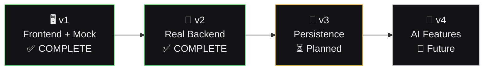
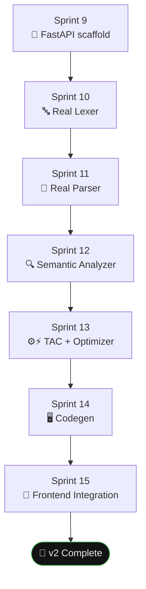

# 🗺️ Version Roadmap
## SmartCC — Solo-Builder Sprint Sequencing

-58A6FF?style=flat-square)

---

## 🛣️ 1. Roadmap Overview

| Version | Theme | Backend? | Status |
|---|---|:---:|---|
| **v1** | Frontend + Mock Data (Full Compiler UI) | ❌ |  |
| **v2** | Real Backend Compiler Engine (FastAPI + PLY) | ✅ |  |
| **v3** | Persistence, History, Multi-Project Support | ✅ |  |
| **v4** | AI-Assisted Features (Error Explanation, LLVM/WASM) | ✅ |  |

> 🧑‍💻 Because this is a **solo build**, phases are strictly sequential — v2 doesn't start until v1 is fully approved, and so on. This avoids half-finished parallel branches, the most common way solo portfolio projects stall.

---

## 🖥️ 2. v1 — Frontend + Mock Data ✅

**Goal:** A fully working, visually complete compiler UI running entirely on mock JSON.

| Sprint | Deliverable | Gate |
|---|---|:---:|
| 1 | App shell, routing, layout, design system foundation | ✅ |
| 2 | Dashboard (stats, recent activity, charts) | ✅ |
| 3 | Compiler Workspace shell: Monaco editor + Pipeline stepper | ✅ |
| 4 | Token Viewer + Symbol Table | ✅ |
| 5 | Parse Tree visualization (React Flow) | ✅ |
| 6 | Semantic Report + TAC Viewer + Optimization Comparison | ✅ |
| 7 | Assembly Viewer + Console + Error Panel | ✅ |
| 8 | Grammar Library, History, Reports, Settings, Help | ✅ |

**✅ v1 exit criteria met:** every PRD requirement demonstrable; fully responsive; zero TypeScript errors; portfolio-ready.

---

## 🐍 3. v2 — Real Backend Compiler Engine ✅

**Goal:** Replace the mock adapter with a real FastAPI + PLY backend that genuinely lexes, parses, analyzes, optimizes, and generates code.

| Sprint | Deliverable | Status |
|---|---|:---:|
| 9 | FastAPI scaffold, `/compile` endpoint skeleton | ✅ |
| 10 | Real Lexer (PLY) — replaces mock tokens | ✅ |
| 11 | Real Parser → AST — replaces mock parse tree | ✅ |
| 12 | Semantic Analyzer (symbol table, undeclared/duplicate checks) | ✅ |
| 13 | TAC generation + Optimizer (constant folding) | ✅ |
| 14 | Target code generation (assembly) | ✅ |
| 15 | `mockAdapter` → `httpAdapter` swap; end-to-end integration | ✅ |

**✅ v2 exit criteria met:** a real program submitted by a user is genuinely compiled through all 6 phases — no mock fallback needed.

---

## 💾 4. v3 — Persistence & Multi-Project Support ⏳

**Goal:** Projects, compilation history, and grammar customizations persist across sessions.

| Sprint | Deliverable |
|---|---|
| 16 | PostgreSQL schema + SQLAlchemy models |
| 17 | Project CRUD (create/rename/delete) |
| 18 | Compilation history persistence + retrieval |
| 19 | Basic auth (per `Security.md`) |
| 20 | Reports powered by real historical data |

> ⏸️ **Not started.** Per Rule 3 below, scope must be re-confirmed before kickoff.

---

## 🤖 5. v4 — AI-Assisted Features & Advanced Targets 🔮

**Goal:** Differentiated, "wow factor" features for the portfolio narrative.

| Sprint | Deliverable |
|---|---|
| 21 | 🧠 AI Error Explanation (LLM-assisted diagnostics) — see [`Memory.md`](./Memory.md) |
| 22 | 🔧 LLVM IR exploration *(stretch)* |
| 23 | 🕸️ WebAssembly target exploration *(stretch)* |
| 24 | ✨ Polish pass: performance, accessibility, portfolio packaging |

---

## 📏 6. Solo-Builder Sequencing Rules

| # | Rule |
|---|---|
| 1️⃣ | **One sprint in flight at a time.** No starting Sprint N+1 before Sprint N is approved. |
| 2️⃣ | **No version-skipping.** v2 work doesn't begin mid-way through v1, even if it seems quick. |
| 3️⃣ | **Re-baseline after each version.** Pause and re-confirm the next version's sprints still make sense. |
| 4️⃣ | **Documentation debt doesn't compound.** Forward-looking docs get filled with real specifics at the start of the version that needs them. |

---

## 📊 7. Current Status Tracker

| Item | Status |
|---|---|
| 📋 PRD.md | ✅ Approved |
| 🏗️ Architecture.md | ✅ Approved |
| 🧩 SystemDesign.md | ✅ Approved |
| 📏 Rules.md | ✅ Approved |
| 🗺️ Phases.md | ✅ Approved |
| 🎨 Design.md | ✅ Implemented |
| 🔌 API-spec.md | ✅ Implemented (`backend/`) |
| 🔒 Security.md | ✅ Applied (v1-v2 scope) |
| 🧪 Testing.md | ✅ Applied (94+ automated tests total) |
| 🧠 Memory.md | 🔮 Forward-looking (v4) |
| 🖥️ v1 (Sprints 1-8) | ✅ **Complete** |
| 🐍 v2 (Sprints 9-15) | ✅ **Complete** |
| 💾 v3 (Sprints 16-20) | ⏳ Not started — awaiting scope confirmation |
