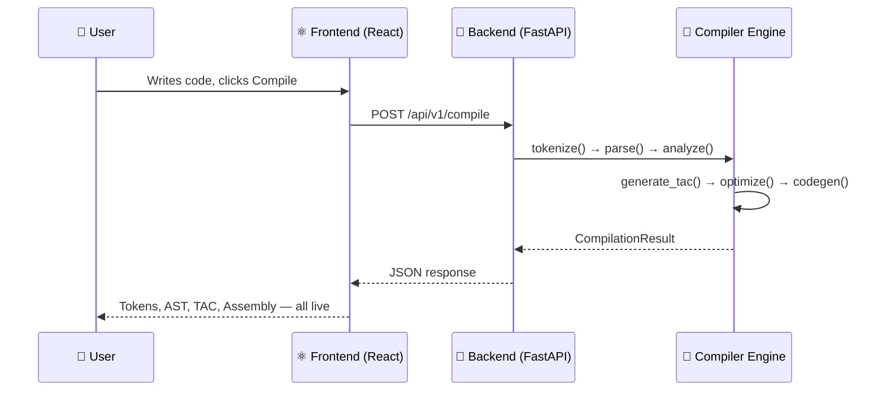
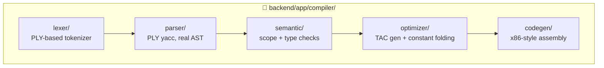
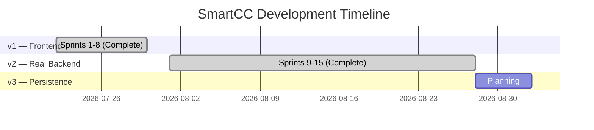

<div align="center">

# 🧠 SmartCC
### Intelligent Mini Compiler & Interactive Compiler Visualizer

**Watch your code become assembly — one phase at a time.**

[](./frontend)
[](./backend)
[](./LICENSE)
[](./CHANGELOG.md)
[](./CHANGELOG.md)

[](./backend/tests)
[](./frontend)
[](./frontend)

</div>

---

## ✨ What is this?

Compiler Design is usually taught through disconnected experiments — a lexer here, a parser there, never a full picture of how source code *actually* becomes machine instructions.

**SmartCC fixes that.** Write C-like code in a VS Code–style editor, hit compile, and watch it flow through a **real, working 6-phase compiler** — visualized live.


Every box above is **real** — not a simulation. Lexical errors, syntax errors, undeclared variables, constant folding, and generated assembly all come from genuine compiler logic (PLY-based lexer/parser + hand-written semantic analysis, optimizer, and codegen).

---

## 📚 Table of Contents

- [Documentation](#-documentation)
- [Quick Start](#-quick-start)
- [Tech Stack](#-tech-stack)
- [How It's Built](#-how-its-built)
- [Project Structure](#-project-structure)
- [Roadmap](#-roadmap)
- [License](#-license)

---

## 📖 Documentation

| Doc | What's inside |
|---|---|
| 📋 [`PRD.md`](./PRD.md) | Product requirements, scope, target users |
| 🏗️ [`Architecture.md`](./Architecture.md) | Frontend architecture, folder structure, data flow |
| 🧩 [`SystemDesign.md`](./SystemDesign.md) | Compiler module responsibilities, shared data models |
| 🎨 [`Design.md`](./Design.md) | Color palette, typography, spacing, motion tokens |
| 📏 [`Rules.md`](./Rules.md) | Coding standards, AI-assisted dev boundaries |
| 🗺️ [`Phases.md`](./Phases.md) | v1 → v4 roadmap and sprint sequencing |
| 🔌 [`API-spec.md`](./API-spec.md) | Backend API contract (implemented in `backend/`) |
| 🔒 [`Security.md`](./Security.md) | Security posture, secrets management, threat model |
| 🧪 [`Testing.md`](./Testing.md) | Test pyramid, correctness testing, CI |
| 🧠 [`Memory.md`](./Memory.md) | Forward-looking AI Engine memory architecture (v4) |
| 📝 [`CHANGELOG.md`](./CHANGELOG.md) | Every sprint, what shipped, what broke, what got fixed |

---

## 🚀 Quick Start

> This is a **monorepo** — `frontend/` and `backend/` run independently. Docs live at this root.

### 1. Frontend

```bash
cd frontend
npm install
cp .env.example .env
npm run dev
```

➡️ Open **http://localhost:5173**

Runs on realistic mock data by default (`VITE_USE_MOCK=true`) — **no backend required.**

### 2. Backend (optional — for the real compiler)

```bash
cd backend
python3 -m venv venv
source venv/bin/activate        # Windows: venv\Scripts\activate
pip install -r requirements-dev.txt
cp .env.example .env
uvicorn app.main:app --reload --port 8000
```

➡️ Open **http://localhost:8000/docs** for interactive API docs

### 3. Connect them

Set `VITE_USE_MOCK=false` in `frontend/.env` (backend must be running) — the UI now runs on the **real compiler**, not fixtures.



---

## 🛠 Tech Stack

<table>
<tr>
<td valign="top" width="50%">

### Frontend


- **Zustand** — state management
- **TanStack Table** — data grids
- **React Flow** — parse tree visualization
- **Recharts** — dashboard charts
- **Framer Motion** — animations
- **Monaco Editor** — code editing

</td>
<td valign="top" width="50%">

### Backend


- **PLY** — real Lexer + Parser (lex/yacc)
- **Pytest** — 64 automated tests
- **Ruff** — linting

</td>
</tr>
</table>

---

## 🧬 How It's Built

Every phase below is **genuinely implemented** — verified against programs that never appeared in any test or fixture.



| Phase | What it really does |
|---|---|
| 🔤 **Lexer** | Tokenizes keywords, identifiers, operators, comments — detects real illegal-character errors |
| 🌳 **Parser** | Builds a real AST with correct operator precedence (`2 + 3 * 4` ≠ `(2+3)*4`) |
| 🔍 **Semantic Analyzer** | Catches undeclared variables, duplicate declarations, unused-variable warnings |
| ⚙️ **TAC Generator** | Emits real Three-Address Code from the AST |
| ⚡ **Optimizer** | Constant folding + propagation — `x=5; return x+2;` → `return 7;` |
| 🖥️ **Codegen** | Emits simplified x86-style assembly from optimized TAC |

---

## 📁 Project Structure

```
smartcc/
├── 🖥️  frontend/            React + TypeScript app
│   └── src/
│       ├── app/            Router, providers
│       ├── layouts/        Shell, Sidebar, Topbar
│       ├── pages/          Route-level containers
│       ├── features/       compiler-workspace, dashboard, projects...
│       ├── components/     Shared UI (ui/, charts/, data-table/)
│       ├── services/       compilerService, mockAdapter, httpAdapter
│       └── types/          Shared TypeScript models
│
├── 🐍 backend/              FastAPI app
│   └── app/
│       ├── main.py         CORS + router registration
│       ├── models/         Pydantic schemas
│       ├── routers/        /compile, /grammar, /history
│       └── compiler/       lexer/ parser/ semantic/ optimizer/ codegen/
│
└── 📄 *.md                  Engineering docs (this level)
```

---

## 🗺 Roadmap



<table>
<tr><td>✅</td><td><b>v1 — Frontend</b></td><td>All 8 sprints complete. Every page functional on mock data.</td></tr>
<tr><td>✅</td><td><b>v2 — Real Backend</b></td><td>All 7 sprints complete. Real 6-phase compiler, connected end-to-end to the frontend.</td></tr>
<tr><td>⏳</td><td><b>v3 — Persistence</b></td><td>Not started. Scope to be confirmed before kickoff (per <code>Phases.md</code> re-baseline rule).</td></tr>
</table>

<details>
<summary><b>📜 Full v2 sprint history</b> (click to expand)</summary>

| Sprint | Delivered |
|---|---|
| 9 | FastAPI scaffold + `/compile`, `/grammar`, `/history` endpoints (stub pipeline) |
| 10 | Real Lexer (PLY) — genuine tokenization + lexical-error detection |
| 11 | Real Parser → AST — precedence-climbing expressions, real syntax errors |
| 12 | Real Semantic Analyzer — undeclared/duplicate detection, unused-variable warnings |
| 13 | Real TAC generation + Optimizer — constant folding, verified on novel programs |
| 14 | Real target codegen — **all 6 phases complete**, verified end-to-end |
| 15 | Frontend `httpAdapter` — real integration, CORS verified, mock/real toggle |

Full detail on every sprint (including bugs found and fixed) is in [`CHANGELOG.md`](./CHANGELOG.md).

</details>

---

## 📄 License

MIT — see [`LICENSE`](./LICENSE).

<div align="center">

**Built by Karan Daiya** · A portfolio project demonstrating full-stack engineering + compiler theory

</div>
