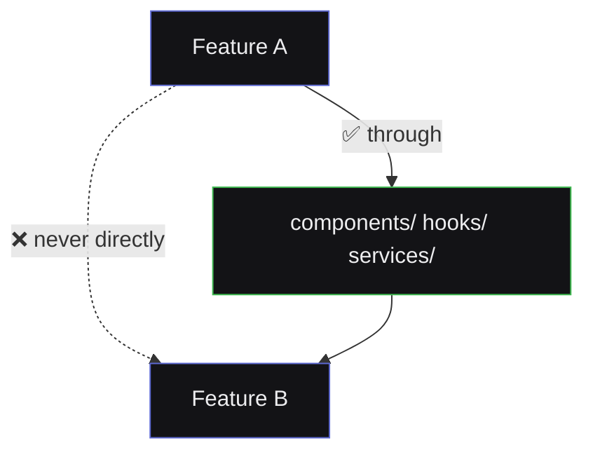

<div align="center">

# 📏 Development Rules & Conventions
## SmartCC — The Binding Rulebook


</div>

> 🎯 **Purpose:** Every sprint — hand-coded or AI-assisted — produces consistent, predictable, production-grade output. **When in doubt, this file wins over convenience.**

---

## 💻 2. Coding Standards

### 2.1 TypeScript
```typescript
✅ strict: true                          // always
✅ interface Foo { }                     // object shapes
✅ type Bar = "a" | "b";                 // unions/aliases (not enums)
❌ any                                   // banned without // any: reason
```

### 2.2 React
- ⚛️ Functional components only — no classes
- 📄 One component per file, filename matches component name
- 🏷️ Props interfaces named `<Component>Props`, directly above the component
- 🧹 No inline business logic in JSX — extract to hooks/utils
- 🌳 No prop drilling beyond 2 levels — use Zustand instead

### 2.3 Naming Conventions

| Type | Convention | Example |
|---|---|---|
| 🧩 Components | `PascalCase` | `ParseTreeView.tsx` |
| 🪝 Hooks | `camelCase`, `use` prefix | `useCompile.ts` |
| 📐 Types/Interfaces | `PascalCase` | `CompilationResult` |
| 📄 Files (non-component) | `camelCase` | `compilerService.ts` |
| 🔢 Constants | `SCREAMING_SNAKE_CASE` | `MAX_TOKEN_PREVIEW` |
| 📁 Folders | `kebab-case` | `compiler-workspace/` |

### 2.4 Styling
- 🎨 Tailwind utility classes only — no separate CSS files
- 🚫 No inline `style={{}}` except computed/dynamic values
- 🔗 Design tokens always from `tailwind.config.ts`, never hardcoded hex

### 2.5 Imports
```typescript
// ✅ Absolute imports via path aliases
import { Card } from '@/components/ui/Card';

// ❌ No deep relative paths
import { Card } from '../../../components/ui/Card';
```
Group order: external libs → internal aliases → relative → styles.

---

## 🧩 3. Folder & Feature Boundaries



Mock data lives **inside the feature that owns it** (`features/compiler-workspace/mocks/`), never in a global dumping ground.

---

## 🚨 4. Error Handling Conventions

| # | Rule |
|---|---|
| 1️⃣ | Every async operation handles **loading / error / success** explicitly. No silent failures. |
| 2️⃣ | User-facing errors are human-readable, phase-tagged — never raw stack traces |
| 3️⃣ | Developer-facing (console) can be verbose; user-facing (UI) must be concise |
| 4️⃣ | Global `<ErrorBoundary>` is a safety net, not a substitute for local handling |
| 5️⃣ | Mock failures use a distinct error type (`MockAdapterError`) — never confused with real logic errors |

---

## 🤖 5. AI-Assisted Development Boundaries

Since this project is built with Claude's help, these rules keep the collaboration disciplined:

| # | Boundary |
|---|---|
| 1️⃣ | 🚦 **Sprint-by-sprint only** — no generating an entire app/feature in one pass |
| 2️⃣ | 🛑 **No silent scope expansion** — backend/DB/auth work flagged, not built early |
| 3️⃣ | 💬 **Explain before generating** — reasoning stated for non-trivial choices |
| 4️⃣ | ✋ **Approval gates are real** — stop after each sprint, wait for sign-off |
| 5️⃣ | 🎯 **Mock data must be realistic** — traced from actual behavior, not lorem-ipsum |
| 6️⃣ | 📦 **No unexplained dependencies** — every new package justified |

---

## 📝 6. Git & Commit Conventions

```
<type>(<scope>): <short summary>

feat(workspace): add resizable sidebar to compiler workspace
fix(token-viewer): correct column offset in token table
docs(architecture): update sprint breakdown after review
chore(deps): add react-flow for parse tree visualization
```

`feat` · `fix` · `docs` · `style` · `refactor` · `test` · `chore`

---

## ✅ 7. Definition of "Done" (Per Sprint)

A sprint is considered complete only when:

- [ ] 🏗️ Code builds with zero TypeScript errors
- [ ] 🧹 No console errors/warnings in dev mode
- [ ] 📱 Responsive at 360px, 768px, 1440px
- [ ] 🔌 Mock data wired through the service layer
- [ ] 📝 `CHANGELOG.md` updated
- [ ] ✋ Explicit approval given before next sprint starts

<div align="center">

*This checklist was applied to all 15 sprints delivered so far — see* [`CHANGELOG.md`](./CHANGELOG.md)

</div>
