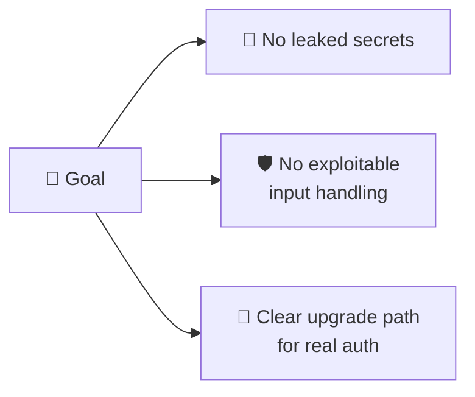
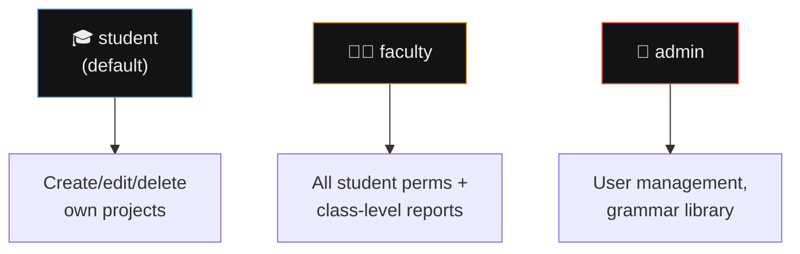

# 🔒 Security Model & Threat Considerations
## SmartCC

> 📌 Proportionate to a **solo-built educational tool**, not an enterprise system. Sections marked "v3+" are forward-looking.

---

## 🛡️ 1. Security Posture Summary

The security model is intentionally scoped to be **realistic for the project's size** — not a copy-pasted enterprise threat model.

---

## 🔑 2. Secrets Management

> ⚠️ **Binding rule, based on a real incident:** an API key was previously committed to a public repo during a past project and had to be rotated. **This does not happen again.**

| # | Rule |
|---|---|
| 1️⃣ | All secrets live in `.env` files only |
| 2️⃣ | `.env` is git-ignored from the **first commit** — verified before pushing |
| 3️⃣ | `.env.example` (placeholders only) is committed instead |
| 4️⃣ | No secret ever hardcoded — including "temporary for testing" |
| 5️⃣ | Accidental commit → rotate immediately + scrub git history |

---

## 🔐 3. Authentication & Authorization

<table>
<tr><th>Phase</th><th>Status</th></tr>
<tr><td>🟢 v1–v2 (Current)</td><td>No auth required — single-user, local/demo only. No PII collected.</td></tr>
<tr><td>🟡 v3+ (Forward-looking)</td><td>JWT session tokens, bcrypt/argon2 hashing, 15-30min token expiry</td></tr>
</table>

### RBAC — v3+ Design

> Deliberately simple (3 roles) — over-engineering RBAC here would be a red flag, not a strength.

---

## ⚔️ 4. Input Handling & Threat Model

The main "attack surface" is **user-submitted source code** sent to `/compile`.

| Threat | Mitigation | Status |
|---|---|:---:|
| 🌀 Malicious/pathological input (infinite loops) | Execution timeout + max input length | ⏳ v2+ |
| 💣 Resource exhaustion (DoS) | Rate limiting per IP/session | ⏳ v2+ |
| 💉 Code injection | Compiler never executes code — only lexes/parses/analyzes. No `eval()` | ✅ |
| 🕸️ XSS via rendered diagnostics | React auto-escapes; no `dangerouslySetInnerHTML` anywhere | ✅ |
| 🗄️ SQL injection | SQLAlchemy ORM, parameterized queries only | ⏳ v3+ |
| 🌐 CORS misconfiguration | Explicit origin allow-list, no wildcard | ✅ **Verified working (Sprint 15)** |

---

## 📊 5. Data Sensitivity Classification

| Data | Sensitivity | Notes |
|---|:---:|---|
| 📝 Submitted source code | 🟢 Low | Educational snippets only |
| 👤 User account info (v3+) | 🟡 Medium | Email + hashed password only |
| 🕒 Compilation history (v3+) | 🟢 Low | Tied to user, not shared |

> No payment data, no sensitive PII, no health/financial data anywhere in scope.

---

## 📦 6. Dependency & Supply Chain Hygiene

- 🔍 `npm audit` / `pip-audit` run before each version milestone
- 📅 No dependency added without checking maintenance status — especially parser-adjacent packages touching untrusted input

---

## 🚫 7. What This Project Deliberately Does NOT Do

| Skipped | Why that's fine |
|---|---|
| Penetration testing program | Disproportionate for a solo educational tool |
| SOC2/compliance docs | Not applicable at this scale |
| Enterprise SSO/SAML | Simple JWT roles are sufficient |

If SmartCC is ever adopted institutionally, **this is the first doc to revisit** — not a reason to over-build now.

