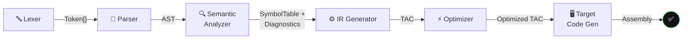
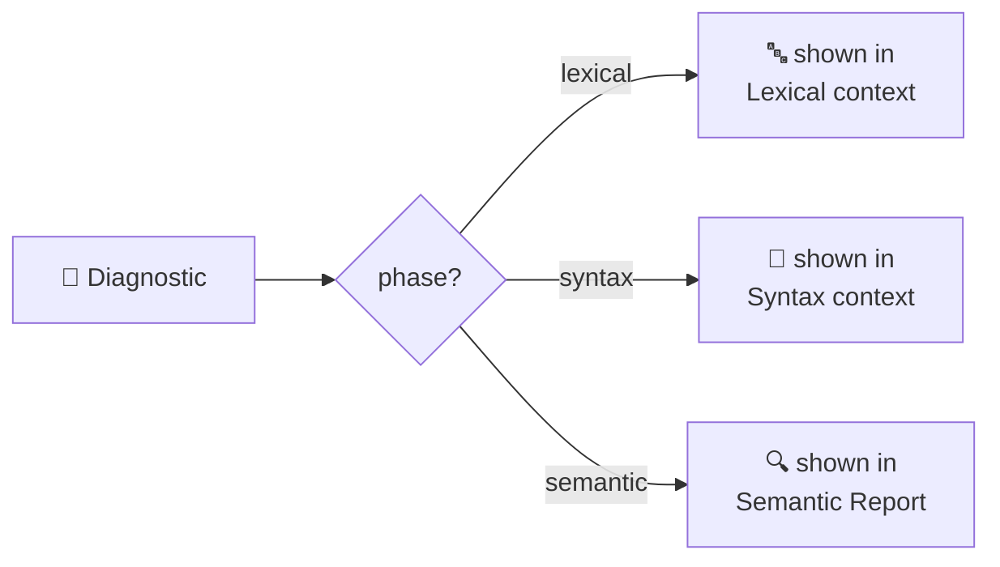

<div align="center">

# 🧩 System Design Document
## SmartCC — Module & Data Model Specification


</div>

| Field | Value |
|---|---|
| Depends On | [`PRD.md`](./PRD.md), [`Architecture.md`](./Architecture.md) |

---

## 🎯 1. Purpose

This document defines the **system-level building blocks** of SmartCC: the compiler modules, the shared data models that flow between them, page-level specs, and the error-handling philosophy.

> ✅ Every module below now has a **real implementation** in `backend/app/compiler/` (v2, Sprints 10-14) — not just a mock contract.

---

## ⚙️ 2. Compiler Pipeline — Module Responsibilities



| Module | Responsibility | Consumed By | Real? |
|---|---|---|---|
| 🔤 **Lexer** | Tokenizes raw source into a token stream | Token Viewer, Parser | ✅ |
| 🌳 **Parser** | Builds Parse Tree / AST; validates grammar | Parse Tree View, Semantic Analyzer | ✅ |
| 🔍 **Semantic Analyzer** | Type checking, scope resolution, symbol table | Symbol Table View, Semantic Report | ✅ |
| ⚙️ **IR Generator** | Converts AST into Three Address Code (TAC) | TAC Viewer | ✅ |
| ⚡ **Optimizer** | Constant folding + propagation on TAC | Optimization Comparison View | ✅ |
| 🖥️ **Target Code Gen** | Emits assembly-like output from optimized TAC | Assembly Viewer | ✅ |

---

## 📐 3. Core Data Models (Shared Types)

> 🔗 Defined once in `frontend/src/types/compiler.ts` **and mirrored field-for-field** in `backend/app/models/compiler.py` (Pydantic). Both the mock adapter and the real HTTP adapter conform to the exact same contract.

```typescript
// ---- 🔤 Lexer ----
interface Token {
  id: string;
  type: TokenType;         // KEYWORD | IDENTIFIER | OPERATOR | LITERAL | ...
  value: string;
  line: number;
  column: number;
}

// ---- 🌳 Parser ----
interface ASTNode {
  id: string;
  kind: string;             // "BinaryExpr", "FunctionDecl", ...
  children: ASTNode[];
  line: number;
  metadata?: Record<string, unknown>;
}

// ---- 🔍 Semantic Analysis ----
interface SymbolEntry {
  name: string;
  type: string;
  scope: string;
  declaredAt: number;
}

interface SemanticDiagnostic {
  severity: "error" | "warning";
  message: string;
  line: number;
  phase: CompilerPhase;
}

// ---- ⚙️ Intermediate Code ----
interface TACInstruction {
  id: string;
  op: string;               // "=", "+", "return", "label", ...
  arg1?: string;
  arg2?: string;
  result?: string;
  label?: string;
}

// ---- ⚡ Optimization ----
interface OptimizationDiff {
  before: TACInstruction[];
  after: TACInstruction[];
  passesApplied: string[];  // ["Constant Folding"]
}

// ---- 🖥️ Target Code ----
interface AssemblyLine {
  instruction: string;
  operands: string[];
  comment?: string;
}

// ---- 📦 Aggregate Result ----
type CompilerPhase =
  | "lexical" | "syntax" | "semantic"
  | "intermediate" | "optimization" | "codegen";

interface CompilationResult {
  tokens: Token[];
  ast: ASTNode | null;
  symbolTable: SymbolEntry[];
  diagnostics: SemanticDiagnostic[];
  tac: TACInstruction[];
  optimization: OptimizationDiff | null;
  assembly: AssemblyLine[];
  status: "success" | "failed";
  failedAtPhase?: CompilerPhase;
}
```

---

## 📄 4. Page-Level System Specs

<table>
<tr><th>Page</th><th>Data Needed</th><th>Source</th></tr>
<tr>
<td>📊 <b>Dashboard</b></td>
<td>Project count, compilation count, error-rate trend, recent activity, phase-wise average time</td>
<td><code>dashboardStats.json</code></td>
</tr>
<tr>
<td>🧪 <b>Compiler Workspace</b></td>
<td>Full <code>CompilationResult</code> per compile action; source buffer (Monaco)</td>
<td>🎭 Mock <i>or</i> 🐍 real backend</td>
</tr>
<tr>
<td>📖 <b>Grammar Library</b></td>
<td>Grammar productions + sample programs</td>
<td><code>GET /grammar/:id</code></td>
</tr>
<tr>
<td>🕒 <b>History</b></td>
<td>Past <code>CompilationRecord</code>s (timestamp, project, status, phase)</td>
<td><code>GET /history/:projectId</code></td>
</tr>
<tr>
<td>📈 <b>Reports</b></td>
<td>Aggregated stats (error types, phase-failure distribution)</td>
<td>Derived client-side, no separate fixture</td>
</tr>
</table>

---

## 🚨 5. Error Handling Model

Errors are always **phase-tagged**, never generic:

```json
{
  "severity": "error",
  "message": "Undeclared variable 'x' used in expression",
  "line": 14,
  "phase": "semantic"
}
```



> 🎯 **This is the core pedagogical value of the product** — a student immediately knows *which compiler stage* rejected their program, never a flat unstructured error list.

---

## 🎭 6. Mock Data Strategy

| Requirement | Approach |
|---|---|
| 🎯 Realism | Fixtures traced from actual manual compilations, not invented |
| ✅ Coverage | One fixture per phase-failure scenario + clean success |
| 🔒 Consistency | All fixtures conform strictly to `CompilationResult` (TypeScript-enforced) |
| 🔌 Swap-readiness | Fixtures live behind `compilerService.compile()`, never imported directly |

---

## 🔒 7. System Constraints

| Constraint | Status |
|---|---|
| No persistence layer (projects/history reset on reload) | Still true — v3 scope |
| No authentication/multi-user support | Still true — v3 scope |
| No backend execution | ❌ **Resolved in v2** — real execution now |

---

## 🔗 8. Traceability Matrix (PRD → Architecture → System)

| PRD Requirement | Component | Data Model |
|---|---|---|
| 🔤 Token Viewer | `TokenViewer` | `Token[]` |
| 🌳 Parse Tree | `ParseTreeView` (React Flow) | `ASTNode` |
| 📋 Symbol Table | `SymbolTableView` (TanStack Table) | `SymbolEntry[]` |
| 🔍 Semantic Report | `SemanticReportView` | `SemanticDiagnostic[]` |
| ⚙️ Three Address Code | `TACViewer` | `TACInstruction[]` |
| ⚡ Optimization Comparison | `OptimizationComparisonView` | `OptimizationDiff` |
| 🖥️ Assembly Viewer | `AssemblyViewer` | `AssemblyLine[]` |
| 🚨 Error Panel | `ErrorPanel` | `SemanticDiagnostic[]` (filtered) |

<div align="center">

Every PRD requirement maps to **exactly one** component and **one** data model — no orphans, no undocumented pieces.

</div>
