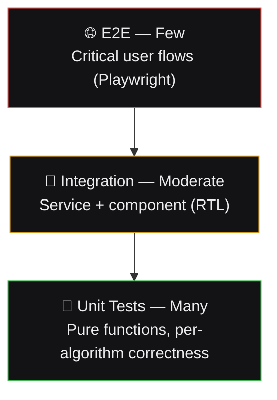
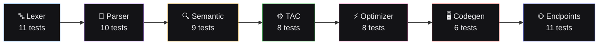
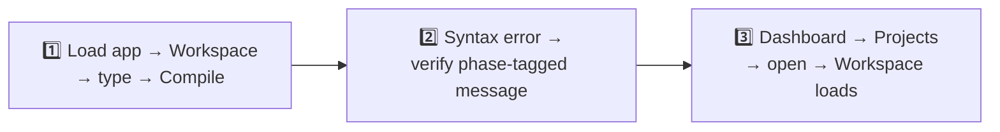
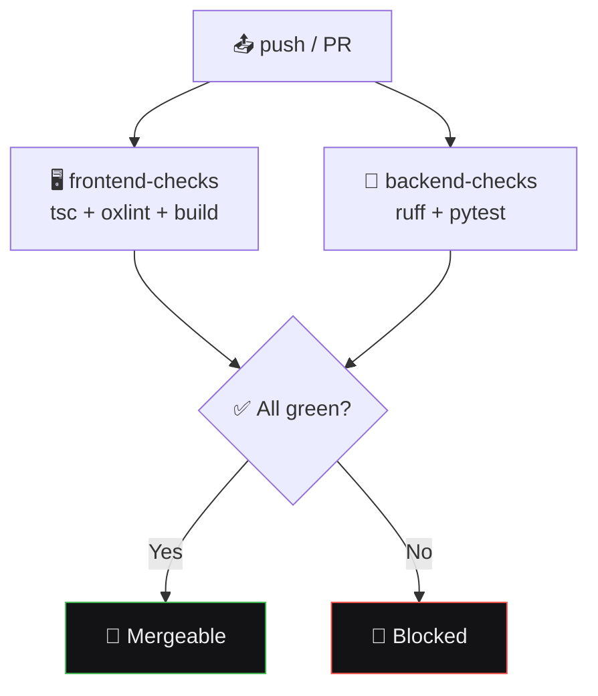

# 🧪 Testing Strategy & CI
## SmartCC

---

## 🔺 1. Test Pyramid

> 🎯 **Principle:** compiler-correctness logic (lexer, parser, optimizer) gets the heaviest investment — a beautiful UI wrapping a wrong compiler defeats the whole purpose.

---

## 🧱 2. Unit Testing

### 2.1 Frontend

| Target | What's tested |
|---|---|
| 🔌 `compilerService` | Correctly typed `CompilationResult`; error states surface correctly |
| 🛠️ Pure utilities | Formatting, diffing, tree flattening |
| 🪝 Hooks (`useCompile`) | State transitions: idle → loading → success/error |
| 🧩 Components | Rendering with representative prop combinations |

### 2.2 Per-Algorithm Correctness Testing (Backend) — ✅ Real, Not Aspirational

| Module | Test Approach | Count |
|---|---|:---:|
| 🔤 **Lexer** | Table-driven: source → exact token list. Covers comments, multi-char operators (`==`, `<=`) | `11` ✅ |
| 🌳 **Parser** | Token stream → exact AST shape + operator precedence + syntax errors | `10` ✅ |
| 🔍 **Semantic** | AST → symbol table + diagnostics (undeclared var, duplicate decl, scope) | `9` ✅ |
| ⚙️ **TAC Generator** | AST → exact TAC sequence, including precedence-correct chaining | `8` ✅ |
| ⚡ **Optimizer** | TAC → hand-verified optimized output (constant folding + edge cases like ÷0) | `8` ✅ |
| 🖥️ **Codegen** | Optimized TAC → exact assembly output | `6` ✅ |
| 🌐 **Endpoints** | Full request/response contract via `TestClient` | `11` ✅ |

**Total: 64/64 passing** — every fixture derived from manually verified compilation traces, never assumed.

---

## 🔗 3. Integration Testing

- 🧪 Compiler Workspace: source → service call → all panels update consistently
- 🚨 Error Panel correctly filters/groups diagnostics by phase
- 📊 Dashboard: stats/charts render correctly from fixtures

---

## 🌐 4. End-to-End Testing (Playwright) — Critical Flows Only

> Not exhaustive by design — 3–5 critical flows, not every page.

---

## ⚙️ 5. CI Pipeline (GitHub Actions)

✅ **Implemented** — see [`.github/workflows/ci.yml`](../.github/workflows/ci.yml)

> 🛑 **Rule:** no merge if `typecheck`, `lint`, or `test` fail. A broken build is worse than no CI at all.

---

## 📊 6. Coverage Expectations

| Layer | Target | Actual | Reasoning |
|---|:---:|:---:|---|
| 🧠 Compiler algorithms | ~85%+ | ✅ High | Correctness-critical core |
| 🔌 Service layer / adapters | ~80%+ | ✅ High | Contract correctness for mock↔real swap |
| 🧩 UI components | ~50-60% | Moderate | Logic-bearing components prioritized |
| 🌐 E2E | Low count, high value | Not yet built | 3-5 flows planned, not exhaustive |

> 📌 **Rule:** coverage % is never the goal itself — an 85%-covered optimizer pass beats a 100%-covered trivial component.
