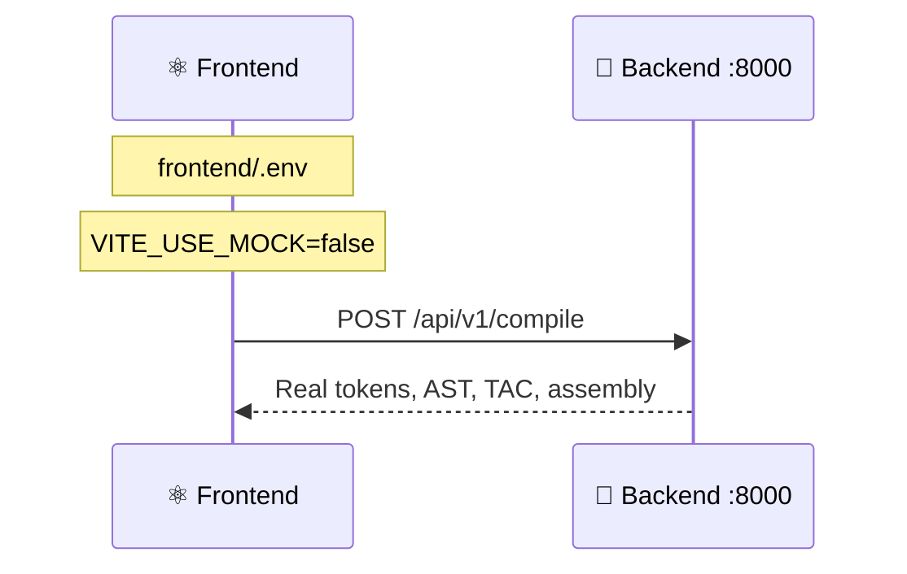

<div align="center">

# 🐍 SmartCC Backend

**A real compiler, built from scratch — not a wrapper around one.**


</div>

---

## ✅ Status: v2 Complete

Every compiler phase below is **real** — verified end-to-end against programs that never appeared in any test or fixture. The frontend now genuinely connects here (Sprint 15).

```mermaid
flowchart LR
    Source(["📝 source code"]) --> Lex["🔤 tokenize()"]
    Lex --> Parse["🌳 parse()"]
    Parse --> Sem["🔍 analyze()"]
    Sem --> TAC["⚙️ generate_tac()"]
    TAC --> Opt["⚡ optimize()"]
    Opt --> CG["🖥️ generate_assembly()"]
    CG --> Out(["✅ CompilationResult"])

    style Source fill:#131316,stroke:#A1A1A6,color:#EDEDEF
    style Lex fill:#131316,stroke:#58A6FF,color:#EDEDEF
    style Parse fill:#131316,stroke:#BC8CFF,color:#EDEDEF
    style Sem fill:#131316,stroke:#D29922,color:#EDEDEF
    style TAC fill:#131316,stroke:#3FB950,color:#EDEDEF
    style Opt fill:#131316,stroke:#F778BA,color:#EDEDEF
    style CG fill:#131316,stroke:#F85149,color:#EDEDEF
    style Out fill:#131316,stroke:#3FB950,color:#EDEDEF
```



---

## 🚀 Getting Started

```bash
python3 -m venv venv
source venv/bin/activate        # Windows: venv\Scripts\activate
pip install -r requirements-dev.txt
cp .env.example .env
uvicorn app.main:app --reload --port 8000
```

➡️ **http://localhost:8000/docs** — interactive Swagger UI, try every endpoint live

### 🧰 Commands

| Command | Purpose |
|---|---|
| `uvicorn app.main:app --reload --port 8000` | 🏃 Start the dev server |
| `python -m pytest tests/ -v` | 🧪 Run the test suite (64 tests) |
| `python -m pytest tests/ --cov=app` | 📊 Run tests with coverage |
| `ruff check .` | 🔍 Lint |
| `ruff check --fix .` | 🔧 Lint + auto-fix |

---

## 📁 Project Structure

```
backend/
├── app/
│   ├── main.py              🚪 FastAPI entry, CORS, router registration
│   ├── config.py            ⚙️  Env-based config
│   ├── models/
│   │   └── compiler.py      📐 Pydantic models — mirrors frontend/src/types/compiler.ts
│   ├── routers/
│   │   ├── compile.py       POST /api/v1/compile
│   │   ├── grammar.py       GET  /api/v1/grammar/:id
│   │   └── history.py       GET  /api/v1/history/:projectId
│   └── compiler/            🧠 The real compiler engine
│       ├── pipeline.py      Orchestrator — chains every phase below
│       ├── lexer/           🔤 PLY-based tokenizer
│       ├── parser/          🌳 PLY yacc — real AST, operator precedence
│       ├── semantic/        🔍 Scope tracking, undeclared/duplicate checks
│       ├── optimizer/       ⚡ TAC generation + constant folding
│       └── codegen/         🖥️  Optimized TAC → x86-style assembly
└── tests/                   🧪 64 tests across every phase
```

---

## 🧩 What Each Phase Actually Does

<table>
<tr><th align="left">Phase</th><th align="left">Real capability</th><th align="left">Tests</th></tr>
<tr>
<td>🔤 <b>Lexer</b></td>
<td>Keywords, identifiers, operators, comments, illegal-character detection with accurate line/column tracking</td>
<td align="center"><code>11</code></td>
</tr>
<tr>
<td>🌳 <b>Parser</b></td>
<td>Real AST via PLY yacc — correct operator precedence (<code>2+3*4</code> ≠ <code>(2+3)*4</code>), real syntax errors</td>
<td align="center"><code>10</code></td>
</tr>
<tr>
<td>🔍 <b>Semantic Analyzer</b></td>
<td>Undeclared variables, duplicate declarations, unused-variable warnings, per-function scoping</td>
<td align="center"><code>9</code></td>
</tr>
<tr>
<td>⚙️ <b>TAC Generator</b></td>
<td>Real Three-Address Code from the AST, per-function temp counters</td>
<td align="center"><code>8</code></td>
</tr>
<tr>
<td>⚡ <b>Optimizer</b></td>
<td>Constant folding + propagation — <code>x=5; return x+2;</code> → <code>return 7;</code></td>
<td align="center"><code>8</code></td>
</tr>
<tr>
<td>🖥️ <b>Codegen</b></td>
<td>Simplified x86-style assembly from optimized TAC</td>
<td align="center"><code>6</code></td>
</tr>
<tr>
<td>🌐 <b>Endpoints</b></td>
<td>Full request/response contract, error handling, CORS</td>
<td align="center"><code>11</code></td>
</tr>
</table>

---

## 🔌 Connecting the Frontend



In `frontend/.env`:
```env
VITE_USE_MOCK=false
VITE_API_BASE_URL=http://localhost:8000/api/v1
```

✅ **Fully functional** (Sprint 15) — the frontend's `httpAdapter` genuinely calls these endpoints. CORS is pre-configured for `http://localhost:5173`; update `CORS_ORIGINS` in `backend/.env` if your frontend runs elsewhere.

---

## 🧪 Try It Yourself

```bash
# Start the server
uvicorn app.main:app --reload --port 8000
```

<table>
<tr><th align="left">Try this...</th><th align="left">To see...</th></tr>
<tr>
<td>

```bash
curl -X POST http://localhost:8000/api/v1/compile \
  -H "Content-Type: application/json" \
  -d '{"source": "int main() { return 0; }"}'
```

</td>
<td>✅ A clean, successful compile</td>
</tr>
<tr>
<td>

```bash
curl -X POST http://localhost:8000/api/v1/compile \
  -H "Content-Type: application/json" \
  -d '{"source": "int x = 5 @ 3;"}'
```

</td>
<td>🔴 A real lexical error (illegal `@` character)</td>
</tr>
<tr>
<td>

```bash
curl -X POST http://localhost:8000/api/v1/compile \
  -H "Content-Type: application/json" \
  -d '{"source": "int main() { return y; }"}'
```

</td>
<td>🟡 A real semantic error (undeclared `y`)</td>
</tr>
</table>

```bash
# Or just run everything:
python -m pytest tests/ -v
```

</br>

<div align="center">

See [`../README.md`](../README.md) for the full project overview.

</div>
